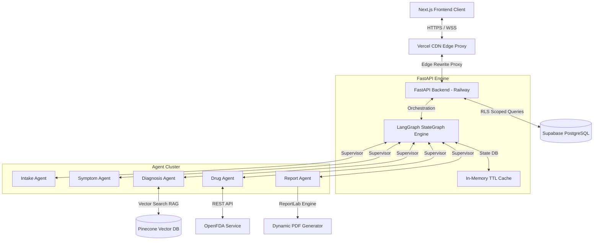

# Technical Architecture Document

## System Overview

MediGuard V2 is a secure, multi-agent Clinical Decision Support System (CDSS) designed to assist emergency room clinicians with real-time patient triage, differential diagnosis compilation, and safety verification. The system uses a supervisor agent model built on LangGraph to coordinate five specialist agents. By combining Retrieval-Augmented Generation (RAG) against peer-reviewed studies with real-time OpenFDA safety audits, MediGuard V2 converts informal clinician intakes into validated clinical compositions, signed visual PDFs, and HL7 FHIR R4 standard bundles in under 60 seconds.

---

## Architecture Layers

### 1. Client Layer (Next.js/Vercel)
A Next.js 14 Single Page Application deployed to Vercel. It manages browser rendering, secure JWT session persistence, real-time agent execution telemetry via WebSockets, and dynamic visual PDF downloads.

### 2. Edge Layer (Vercel Rewrites)
Handles edge routing rules in `vercel.json` to proxy browser requests sent to `/api/v1/*` directly to the FastAPI backend on Railway, bypassing ISP DNS blocks (e.g. JioFiber DNS overrides) and eliminating browser CORS complications.

### 3. API Layer (FastAPI/Railway)
An asynchronous FastAPI engine deployed on Railway inside a Docker container. It serves REST API endpoints, handles JWT clinician authentication, operates WebSocket channels, and manages IP rate limit stores.

### 4. Orchestration Layer (LangGraph)
Uses a StateGraph orchestrator using a Supervisor agent pattern. The supervisor audits the global state after each agent execution, writing metrics and routing to the next clinical step or triggering the emergency bypass.

### 5. Agent Layer (5 Specialist Agents)
Five independent, specialized LLM agents (using Claude models via AWS Bedrock):
* **Intake Specialist**: Haiku model parsing intake logs into strict schemas.
* **Symptom Triage**: Sonnet model grading severity, mapping timelines, and finding red flags.
* **Diagnostic RAG**: Sonnet model querying PubMed studies to suggest differentials.
* **Drug Safety**: Haiku model auditing active prescriptions against FDA registries.
* **Report Compiler**: Sonnet model synthesizing compositions into PDFs and FHIR bundles.

### 6. Data Layer (Supabase + Pinecone)
* **Supabase (PostgreSQL)**: Stores session histories, multi-tenant schemas, and credentials under strict Row Level Security (RLS).
* **Pinecone**: Vector database housing 500+ indexed PubMed medical articles.

### 7. External APIs (Bedrock/FDA/PubMed)
* **AWS Bedrock**: Serves Claude 3 Sonnet and Haiku API access.
* **OpenFDA**: Public REST API for verification of 100K+ drug labels.
* **PubMed E-utilities**: Search database providing literature retrieval.

---

## Agent Pipeline

| Agent | Input | Process | Output |
| :--- | :--- | :--- | :--- |
| **Intake Agent** | Unstructured voice transcript, typed notes, or FHIR imports | Parses entities into structured medical lists; maps vital signs | `parsed_intake_data` JSON |
| **Symptom Agent** | Structured intake data, complaint vectors | Maps severity (0-10), onset timelines, and triggers emergency bypass if red flags are detected | `symptoms_analysis` JSON |
| **Diagnosis Agent** | Timeline symptoms, medical history | Performs Pinecone Vector Search (RAG) on PubMed studies; builds ranked differentials with citations | `differential_diagnoses` JSON |
| **Drug Check Agent** | Current home medications, allergies, diagnoses | Queries OpenFDA for drug interactions, allergies, and contraindications | `interaction_warnings` JSON |
| **Report Agent** | All accumulated agent states | Formats findings, signs documents, and generates visual PDFs and FHIR R4 compositions | PDF files & FHIR bundles |

---

## Data Flow

1. **Submission**: Clinician submits patient data via voice, typed form, or FHIR EHR import.
2. **Authentication check**: Backend validates JWT token and institution code, logging a `session_created` event to the audit trail.
3. **Orchestrator Init**: The supervisor initializes the StateGraph and schedules the Intake Agent.
4. **Intake Processing**: Intake Agent parses input into schema and transfers control to Symptom Agent.
5. **Safety Triage**: Symptom Agent evaluates urgency. If a "critical" condition (e.g. active stroke) is detected, it triggers the **Emergency Gate**, routing immediately to Step 8.
6. **Diagnostic retrieval**: For stable patients, the Diagnosis Agent queries Pinecone, retrieving PubMed articles above a 0.72 similarity score.
7. **Drug Auditing**: The Drug Agent queries OpenFDA, checking for drug-drug interactions and allergy conflicts.
8. **Composition & Output**: The Report Agent compiles clinical summaries, generates visual PDFs, constructs FHIR Composition bundles, saves state, and marks the session as `completed` in Supabase.

---

## Security Model

* **JWT Authenticated Scoping**: Every API request must carry a valid JWT token. Clinician credentials (staff ID, institution ID, role) are verified on every call.
* **Database Row Level Security (RLS)**: Enforced directly on Supabase PostgreSQL tables. Every query is automatically scoped to the user's `institution_id`, making cross-hospital data access impossible.
* **Rate Limiting**: Sliding-window rate limit store (max 3 runs/hour/IP) gates public demo routes to prevent LLM quota exhaustion.
* **Immutable Audit Trail**: Chronological HIPAA compliance logging. Every session create, retrieve, PDF download, and pipeline execution is recorded to an append-only table.

---

## Key Design Decisions

1. **LangGraph over Linear Chain**: Supported loops, complex conditionals, and parallel agent steps. This let us build the Emergency Gate bypass, which is not possible in simple sequential chains.
2. **AWS Bedrock over OpenAI**: Enforced VPC security isolation. Customer data submitted to AWS Bedrock is never used to train base models, satisfying healthcare privacy demands.
3. **Supabase RLS over App-Layer Checks**: Enforcing isolation at the database layer prevents security check bypasses in API code, providing database-level protection.
4. **PubMed Vector DB over Static Manual Guidelines**: Using vector RAG enables dynamic updates as new clinical publications are released without rewriting agent prompts.
5. **DeepEval CI/CD Safety Gate**: Enforcing automated LLM evaluation in GitHub Actions prevents silent regressions in clinical accuracy before changes hit production.

---

## External Dependencies

| Service | Purpose | Cost |
| :--- | :--- | :--- |
| **AWS Bedrock** | Claude 3 Sonnet and Haiku model endpoint access | Pay-per-token usage |
| **Pinecone DB** | Vector database housing PubMed article embeddings | Free Tier |
| **Supabase** | Multi-tenant PostgreSQL database & user access control | Free Tier |
| **OpenFDA** | Real-time drug-drug interaction validation database | Free API |
| **PubMed E-utilities** | literature searches for RAG databases | Free API |
| **Railway Cloud** | Backend FastAPI Docker container hosting | Hobby Tier |
| **Vercel** | Frontend Next.js deployment and global Edge CDN | Hobby Tier |
